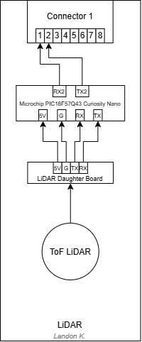

## Overview
This block diagram outlines the architecture of the LiDAR subsystem, illustrating the flow of data and power between the sensor, microcontroller, and the broader team system.

* **Power levels:** The system utilizes a 5V stepdown power supply and a common ground (G), which are connected between the LiDAR Daughter Board and the Microchip PIC18F57Q43 Curiosity Nano.
* **Sensor:** A Time-of-Flight (ToF) LiDAR sensor is utilized to gather spatial data, which feeds directly into the LiDAR Daughter Board.
* **Actuator:** There are no actuators present within this specific subsystem.
* **Team connections:** Integration with the main system is handled via Connector 1. The microcontroller communicates with the team system using its RX2 and TX2 pins, which are routed to pins 1 and 2 on the connector.
* **Power source:** The 5V power and Ground (G) are routed between the LiDAR Daughter Board and the Microchip PIC18F57Q43 Curiosity Nano. 

## Individual Block Diagram 
Below is the block diagram representing the LiDAR subsystem architecture.

